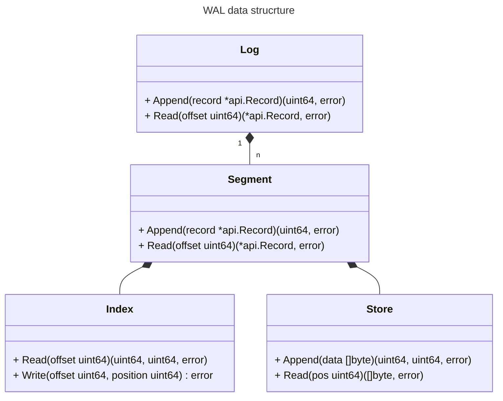

# yawal

Yet another write ahead log(yawal) is a simple write ahead log library.

## Usage
```go

```


```mermaid
---
title: WAL data strucrture
---
classDiagram
    class Log {
        + Append(record *api.Record) (uint64, error)
        + Read(offset uint64) (*api.Record, error)
    }

    class Segment {
        + Append(record *api.Record) (uint64, error)
        + Read(offset uint64) (*api.Record, error)
    }

    class Index {
        + Read(offset uint64) (uint64, uint64, error)
        + Write(offset uint64, position uint64) error
    }

    class Store {
        + Append(data []byte) (uint64, uint64, error)
        + Read(pos uint64) ([]byte, error)
    }

    Log "1" *-- "n" Segment
    Segment *-- Index
    Segment *-- Store
```

# Performance Concerns

* Use `truncate` and `fdatasync` instead of `fsync`.
