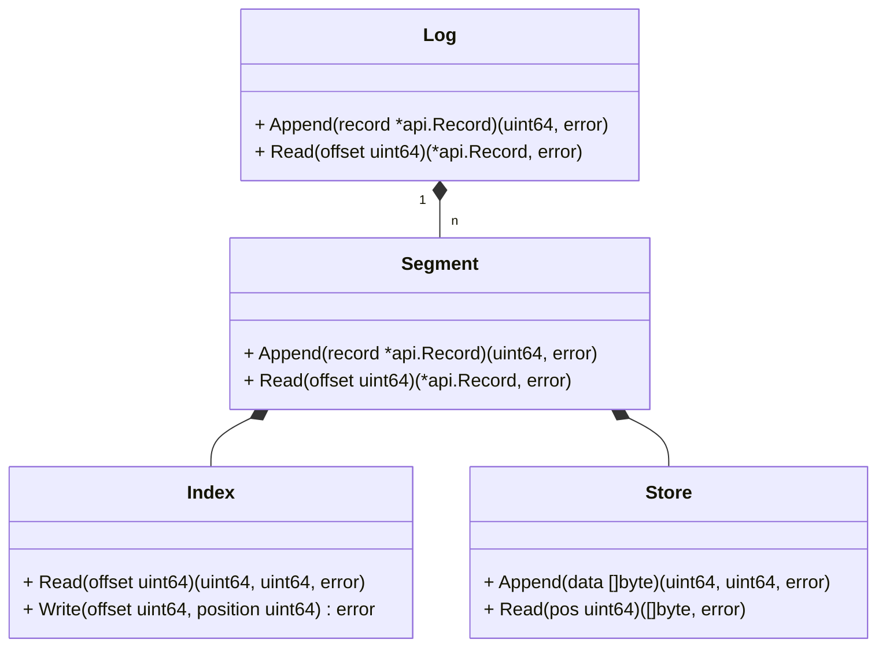

# yawal

Yet another write ahead log(yawal) is a simple read or append log library. It consists of four components: Log, Segment, Index and Store.

* **Log** is an abstract concept which only has two public method `Append(record)` and `Read(offset)`. `Append` appends record at the end of a file. `Read` reads the record at the offset position.
* **Segment** is a collection of records.
* **Index** is the offset of a record in the log, which stores offset and position of a record.
* **Store** store records in a file.
* **Offset** is the index of a record in the log.
* **Position** is the offset of a record in the file.

